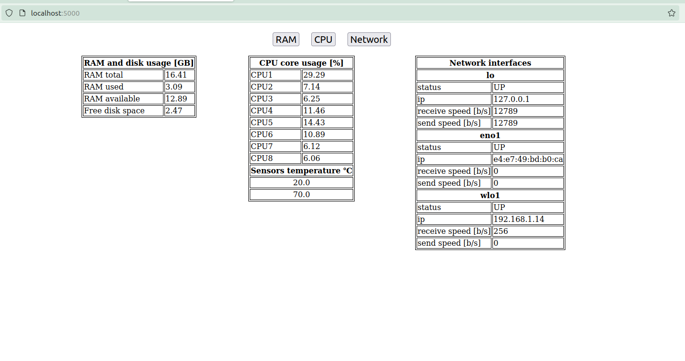

To execute a program on system startup I copied a script to `/bin` folder by command
```
sudo cp system_readings.py /bin
```
Then created a cron job scheduler by command
```
crontab -e
```
And then at the bottom of a file that showed up added
```
@reboot python3 /bin/system_readings.py &
```

To start a web page type
```
node app.js
```

Screen of a working app

